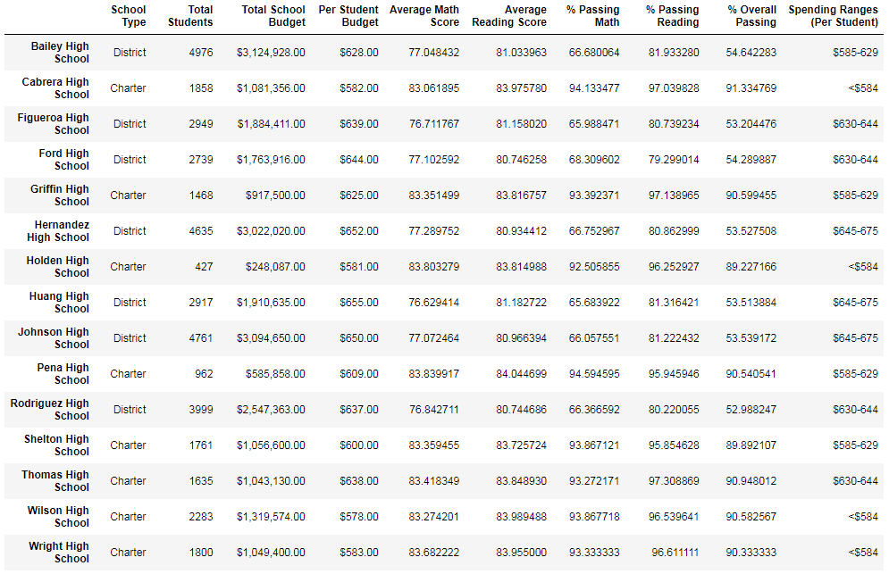

# School_District_Analysis

## Overview of Project

The purpose of this project was to analyze reading and math test scores across different schools in a district and grade levels. Further analysis was done to account for school budgets, spending per student, school population sizes as well as the classification of the school (district or charter). Once it was discovered that one high school had a case of acedemic dishonesty the analysis was done again after removing those grades for a more accurate analysis.

## Results
### How is the district summary affected?
- After adjusting for the discrepencies and executing the analysis again no change can be seen between the two district summaries.
  
  
### How is the school summary affected?
- There is virtually no change between the school summaries after the adjustments. The top 5 and bottom 5 schools for test remain the same. Not only did the schools remain the same, the order also remained the same. The new analysis did not produce anything significant.

### How does replacing the ninth graders’ math and reading scores affect Thomas High School’s performance relative to the other schools?
- Thomas High School, where the dishonesty occurred, had a small change in average reading score, percent passing math, percent passing reading, and overall percent passing. The changes were an increase of .05 points in average reading scores and a drop of .09, .29, .31 points respectively in the other categories. Overall, the adjustment did not produce any significant findings. See above images for details.
### How does replacing the ninth-grade scores affect the following:
- Math and reading scores by grade
  - Math and reading scores did not change after replacing the test data. However, with reading the scores were replaced with nan due to the academic integrity issue that was discovered.

- Scores by school spending
  - All scores stayed the same for all the schools with one exception. Thomas High School had the reported drop as indicated before. Still nothing significant.

- Scores by school size
  - The adjustments did not make a difference in school size as well. In fact there was zero change.

- Scores by school type
   Once again, there was zero changes from before the adjustments and after. The discovery of the academic dishonesty was only a small blip that had no consequences to our analysis.

## Summary
Our analysis remained the same despite the discovery of academic dishonesty. The only affect it had was on the individual school and not at another variable. What we can draw from the analysis is that charter schools produce significantly better test scores and 90% of the students pass both math and reading. We can also see that schools with 2,000 or less students also yield better results with the smaller the better. I do not consider the total budget of the school to be an important factor. The amount spent per student is a more telling measure. Schools will have different budgets based on a number of variables. What we can see is that more spending per student is not necessarily a recipe for success. In fact, the schools with the most spending ($637 and more) more often than not have just over a 50% pass rate for both math and reading. 
